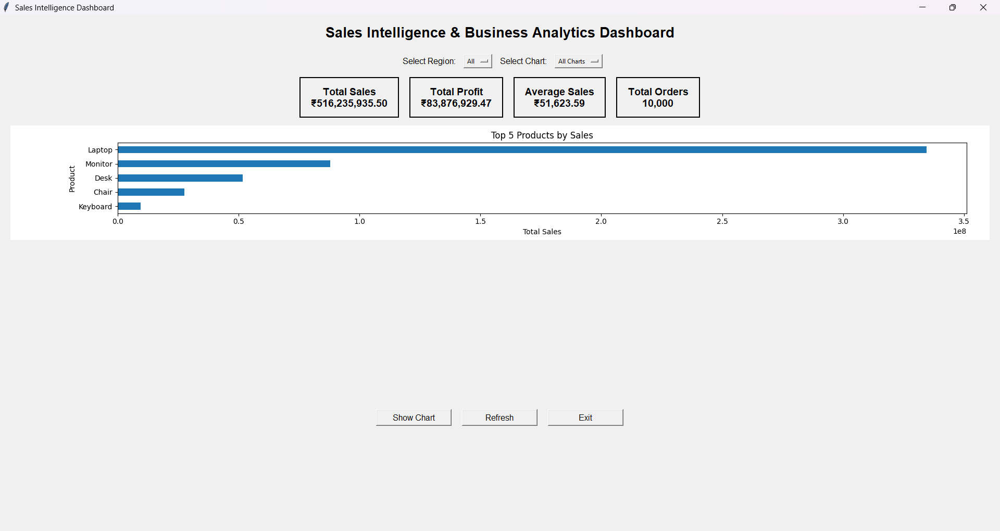
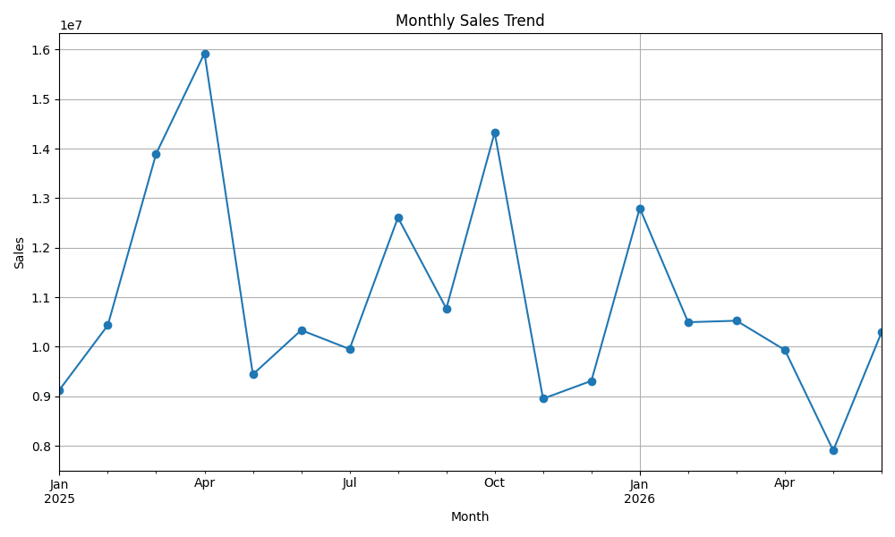
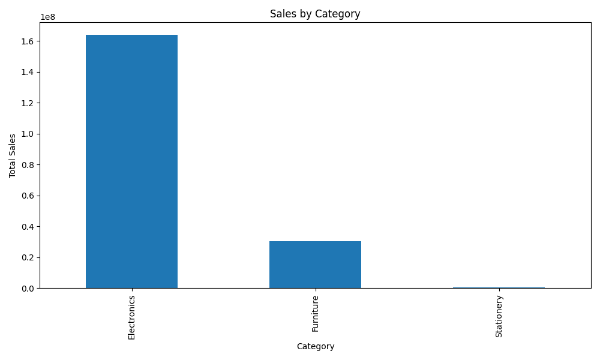
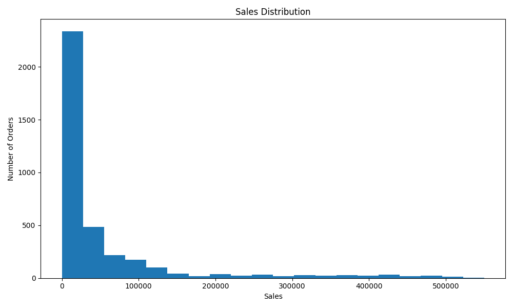
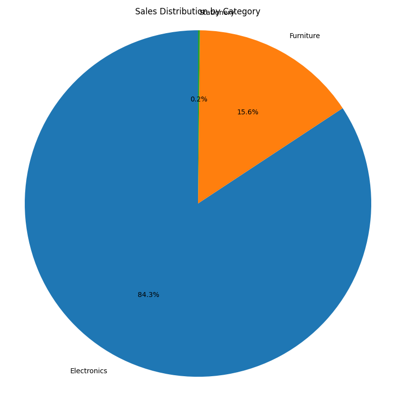

# 📊 Sales Intelligence & Business Analytics Platform

A Python-based sales analytics platform that transforms raw sales data into meaningful business insights through data cleaning, data validation, exploratory data analysis,  data visualization, and an interactive dashboard.

---

## 📌 Project Overview

The **Sales Intelligence & Business Analytics Platform** analyzes sales transaction data to understand business performance across products, categories, customers, and regions.

The project follows an end-to-end data analytics workflow:

**Raw Data → Data Cleaning → Data Validation → EDA → SQL Analysis → Visualization → Interactive Dashboard → Business Insights**

The objective is to convert raw business data into meaningful insights that can support data-driven decision making.

---

## 🎯 Objectives

- Clean and preprocess raw sales data
- Validate data quality and consistency
- Perform Exploratory Data Analysis (EDA)
- Analyze sales and profit performance
- Identify high-performing products and categories
- Analyze regional sales performance
- Perform business analysis using SQL
- Create meaningful data visualizations
- Build an interactive dashboard
- Generate actionable business insights

---

## 🚀 Key Features

### 🧹 Data Cleaning

- Handling missing values
- Removing duplicate records
- Validating data types
- Checking invalid or inconsistent values
- Preparing clean data for analysis

### ✅ Data Validation

- Sales validation
- Profit validation
- Quantity validation
- Price and discount checks
- Dataset consistency checks

### 📈 Exploratory Data Analysis

The project analyzes:

- Total sales
- Total profit
- Average sales
- Average profit
- Number of orders
- Sales by category
- Sales trends
- Sales distribution
- Product performance
- Regional performance

### 🗄️ Pandas Business Analysis

pandas is used for business-oriented analysis such as:

- Top-selling products
- Category performance
- Regional performance
- Customer analysis
- Sales trends
- Aggregated sales and profit metrics

### 📊 Data Visualization

The project uses Matplotlib to create visualizations that make business patterns easier to understand.

Visualizations include:

- Monthly sales trend
- Sales by category
- Sales distribution
- Sales distribution histogram

### 🖥️ Interactive Dashboard

The dashboard provides:

- Total Orders
- Total Sales
- Total Profit
- Average Sales
- Region-based filtering
- Interactive visualizations

---

## 🖥️ Dashboard Preview



The interactive dashboard provides a quick overview of the major sales and profit KPIs and allows users to explore the dataset using filters and visualizations.

---

## 📊 Data Visualizations

### 📅 Monthly Sales Trend



This visualization shows how sales change over time and helps identify monthly sales patterns and trends.

---

### 🏷️ Sales by Category



This visualization compares total sales generated by different product categories.

---

### 📈 Sales Distribution Histogram



The histogram shows the distribution of sales values across the dataset and helps understand the spread of transaction values.

---

### 📊 Sales Distribution



This visualization provides another view of how sales values are distributed across the dataset.

---

## 📌 Key Results

The current dataset contains **10,000 sales transactions**.

### Key Performance Indicators

| KPI | Value |
|---|---:|
| Total Orders | 10,000 |
| Total Sales | ₹516,235,935.50 |
| Total Profit | ₹83,876,929.47 |
| Average Sales | ₹51,623.59 |
| Average Profit | ₹8,387.69 |

---

## 🏆 Category Performance

| Category | Sales |
|---|---:|
| Electronics | ₹436,111,395.00 |
| Furniture | ₹79,213,000.00 |
| Stationery | ₹911,540.50 |

**Electronics generated the highest sales among the available categories.**

---

## 🔄 Data Analytics Workflow

```text
                    Raw Sales Data
                          │
                          ▼
                   Data Cleaning
                          │
                          ▼
                  Data Validation
                          │
                          ▼
              Exploratory Data Analysis
                          │
                          ▼
                Data Visualization
                          │
                          ▼
               Interactive Dashboard
                          │
                          ▼
                  Business Insights
```

---

## 🛠️ Technologies Used

| Category | Tools |
|---|---|
| Programming Language | Python |
| Data Analysis | Pandas, NumPy |
| Data Visualization | Matplotlib |
| Database / Querying | 
| Dashboard | Tkinter |
| Development Tools | Git, GitHub, VS Code, Jupyter Notebook |

---

## 📁 Project Structure

```text
SALES_INTELLIGENCE_PLATFORM/
│
├── data/
│   ├── cleaned/
│   │   └── sales_cleaned.csv
│   │
│   └── raw/
│       └── sales.csv
│
│
├── src/
│   ├── dashboard.py
│   ├── data_cleaning.py
│   ├── data_validation.py
│   ├── eda.py
│   ├── sql_queries.py
│   ├── utils.py
│   └── visualization.py
│
├── visuals/
│   ├── monthly_sales_trend.png
│   ├── sales_by_category.png
│   ├── sales_distribution_histogram.png
│   └── sales_distribution.png
│
├── README.md
└── requirements.txt
```
